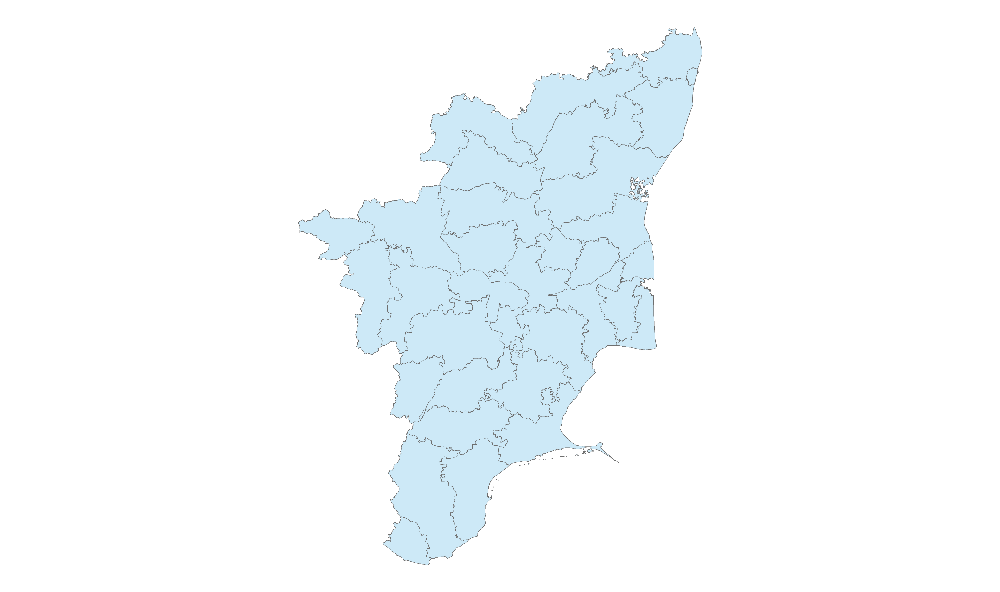
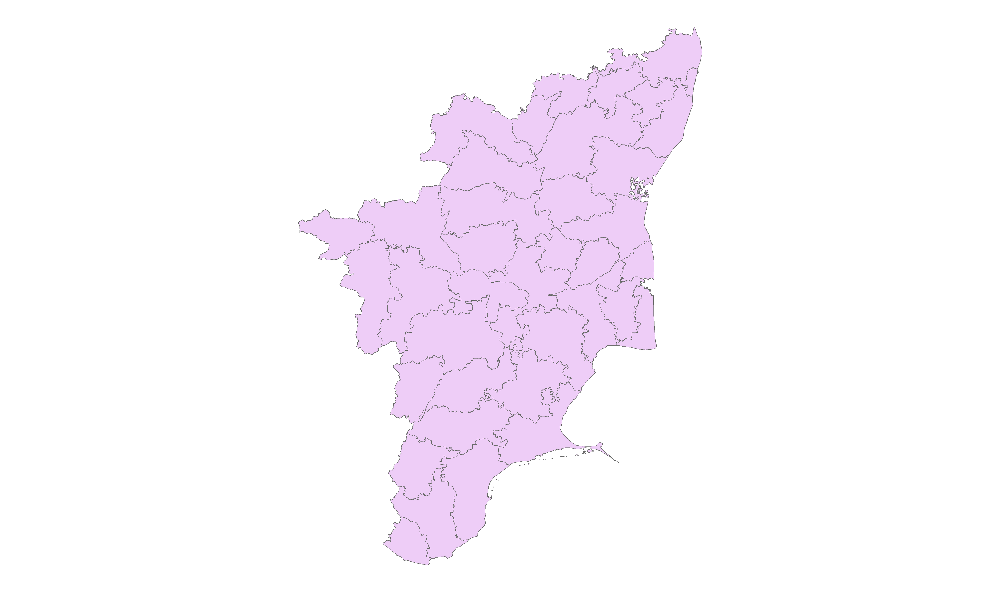

# India_Official_Boundaries_2019

Source:
National Informatics Centre

District Boundaries will be updated as per any issues coming in. The updates will be from official maps and mandates of the Government of India. Codes will try to align with the 2011 Census and anything updated from http://lgdirectory.gov.in/.

Updates:
Andhra Pradesh code updates to have state = 28 insteadof 37.
Ladakh code updates to have state = 37 instead of 38.

Tamil Naduu has numerous boundary adjustments. 
Chennai needs review as its district boundaries should align with the Municipal Corporaation boundaries.
Erode District/ Tirupur District
chengalpattu (parent: kancheepuram)
kallakurichi (parent: villupuram)
ranipet (parent: vellore)
tirupathur (parent: vellore)
tenkasi (parent: tirunelveli)

